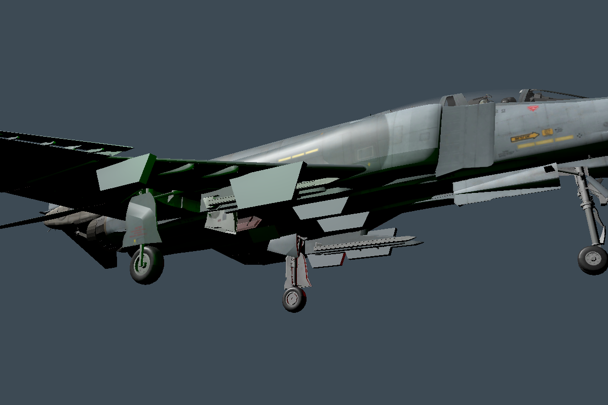

# F-4E Phantom II for Nuclear Option

A playable F-4E Phantom II aircraft add-on for Nuclear Option, built with Blueprinter.

## Features
- F-4E exterior with textured gray livery.
- Four underwing pylons and two fuselage weapon stations.
- Twin exhaust outlets and throttle-controlled twin afterburner visuals.
- Working native cockpit displays, HUD, flight systems, weapons and landing gear.
- Rank 1, $20 million in-game purchase price.

The flight and cockpit systems are adapted from the native FS-12. This is a simple
playable aircraft integration, not a full historical F-4 systems simulation.

## Requirements
- Nuclear Option 0.34.2
- BepInEx 5
- Blueprinter 2.0.1 or later

## Install
Download `F-4E Phantom II_1.1.5.nobp` from [Releases](https://github.com/Braianvladzgrid/F4E-Phantom-NuclearOption/releases).
Close the game and place the file in `BepInEx/plugins/f4ephantom/`.
Keep only one active version of this aircraft. NOMM availability depends on approval
of its NOMNOM registry submission.

## Source and rebuilding
This repository includes the mod assets and custom Unity editor/runtime source.
Use Unity 2022.3.62f2 with the [Blueprinter editor](https://github.com/nikkorap/Blueprinter-Editor),
its package and the locally generated game-asset reference catalog, then copy this
repository's `Assets` contents into the editor project. Run `F4EUpgradeBuild.Run`
or use the editor build-request workflow in `F4ETestBuild`.
Game binaries, extracted vanilla meshes/textures/audio, Unity caches, credentials,
and local game logs are not part of this repository. Native resources are resolved
at runtime by Blueprinter from the player's installed game; the original vanilla
afterburner mesh references are normalized using transforms, not copied mesh data.

## Credits and licenses
The aircraft model is based on **F-4E Phantom II** by **Kenny3D89**:
https://sketchfab.com/3d-models/f-4e-phantom-ii-414342cad1e84b20aadace5de69c9569
Author: https://sketchfab.com/Kenny3D89
Model and supplied textures: **CC BY 4.0**, https://creativecommons.org/licenses/by/4.0/
Changes include coordinate/scale conversion, landing-gear separation, pylon geometry,
exhaust integration, cockpit positioning, and Blueprinter integration.
Custom code and original procedural additions: MIT; see `LICENSE`.
Nuclear Option and its original content belong to Shockfront Studios.
Blueprinter is by nikkorap and remains a separate dependency.

## Validation
Version 1.1.4 was confirmed locally to load, appear in the aircraft selection menu,
show its livery, pylons and twin exhausts, and enter the mission using Fly with
working cockpit displays. The user confirmed the local version worked well.
The public package references the same native afterburner meshes directly instead
of distributing copied mesh derivatives. In-game appearance should be reported
through this repository's issues if any problems occur.

## Version 1.1.5
Purchase price reduced to $20 million and required rank reduced to 1. The build validates both values; aircraft geometry, cockpit and weapon systems are retained.
